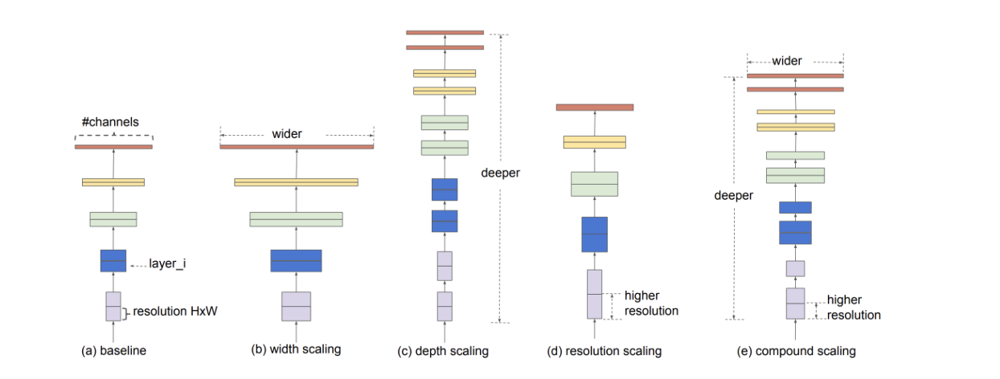

# EfficientNetV2

For the first time, with EfficientNet, a new approach has been introduced: compound scaling. This approach focuses on the simultaneous scaling of all three dimensions of a neural network (width, depth and resolution of the input), rather than on a single dimension alone. In the Efficient Net, three constant coefficients are determined by conducting a small grid search on the model. The depth (d), the width (w) represented by and finally the image size (r). These three values are scaled by a compound coefficient Phi.

 

    

  <em>Model scaling: the figure represents examples of model scaling. The first figure represents the baseline (a), followed by an example of width scaling (b), depth scaling (c) and resolution scaling (d). The last network represents the compound scaling (e), wich scales all the three previous dimensions.</em>

The objective is to achieve a balance between the three parameters by maintaining a constant ratio. The efficient net is designed to optimise the network for achieving higher accuracy while penalising any computational inefficiency and slow inference times. 

***Official [paper](https://arxiv.org/abs/1905.11946v5) available.***

For further information please visit the official Pytorch [documentation](https://pytorch.org/hub/nvidia_deeplearningexamples_efficientnet/) about EfficientNet.
