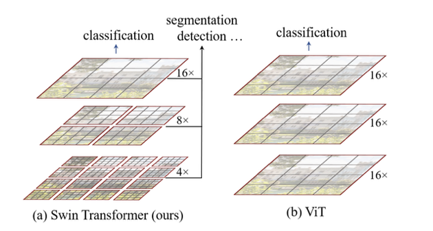

# SwinT

The Swin Transformer can be considered an improvement on the classical Vision Transformer, which was previously presented. In fact, the SwinT architecture is able to overcome the problem of quadratic complexity, and in fact, it is able to make it even linear while maintaining high accuracy. The Swin Transformer generates a hierarchical representation, commencing with the aggregation of smaller-sized patches and subsequently integrating neighbouring patches in deeper Transformer layers. The model achieves linear computational complexity by calculating self-attention locally within non-overlapping windows that segment the image.
 

    

  <em>Shifted Windows (Swin Transformer) vs Normal Windows (Vision Transformer): the Swin transformer on the left (a) builds hierarchical feature maps by merging together the patches of a given image, while normal Vision Transformer (b) produces feature maps of a single row resolution.</em>

For further information please visit the official Pytorch [documentation](https://pytorch.org/vision/stable/models/swin_transformer.html) about Swin Transformer.
