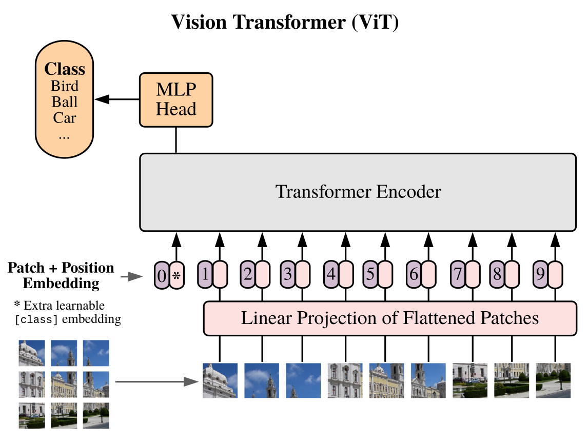

# ViT 16

The Vision Transformer (ViT) architecture, introduced by Dosovitskiy et al., diverges from the conventional approach of using convolutions to process images. Instead, it splits an image into fixed-size patches, which enables the transformer to capture long-range dependencies, a capability that is particularly beneficial for understanding complex spatial relationships in images. The core idea is to treat image patches as tokens, analogous to words in a sentence, and employ a transformer encoder to model their relationships.

 

    

  <em> ViT 16 architecture: as can be seen in this figure, ViT16 splits the input image into fixed-size patches, it linearly embed them and feed this embeddings to the Transformer Encoder. Then, a standard MLP Head is used for classification.</em>

The transformer encoder is structured as an alternating sequence of multihead self-attention (MSA) and multi-layer perceptron (MLP) blocks. Prior to each block, layer normalisation (LN) is applied. The MLP also contains two layers with a GELU non-linearity.

***Official [paper](https://arxiv.org/abs/2010.11929v2) available***

For further information please visit the official Pytorch [documentation](https://pytorch.org/vision/main/models/vision_transformer.html) about Vision Transformer.
